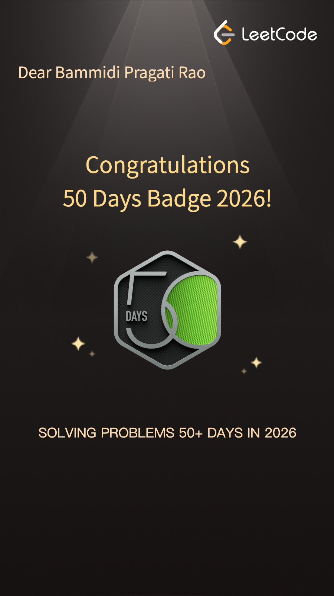

<h1 align="center">Bammidi Pragati Rao 👋</h1>

  <strong>System Developer | Data Scientist | AI & Automation Expert</strong>

<!-- Typing SVG -->

  

<!-- Terminal SVG Section -->

  

 

<!-- Social Badges Row -->

  
  
  
  
  
  

 

---

<!-- About Me Section -->
## 🙋 About Me

- 🎓 **Education:** Currently pursuing **M.Tech in Computational and Data Sciences** at the **National Institute of Technology Surathkal (NITK)** (Aug 2025 – Present). Holds a **B.Tech in Computer Science and Engineering** from **Sri Sairam College of Engineering** (Aug 2019 – June 2023).
- 💼 **Experience:** Former **Software Engineer** at **Tata Consultancy Services (TCS)** (Aug 2023 – Sept 2025), architecting and maintaining PEGA BPM and UiPath RPA automations.
- ⚙️ **Core Stack:** Python, SQL, JavaScript, React, Node.js, Flask, PyTorch, and DB2.
- 🔬 **AI & Automation:** Proficient in designing smart chatbots using **Kore.ai**, indexing systems using **Search.ai**, and training semantic search pipelines using Transformers (S-BERT).
- 🤖 **Interests:** Generative AI, Machine Learning, Predictive Process Mining (Attention-based LSTM), and Scalable System Architecture.
- 📍 **Location:** Surathkal, Karnataka, India.

 
 

---

<!-- Currently Working On Section -->
## 🛠️ Currently Working On

  <table border="0">
    <tr>
      <td><strong>Current Focus</strong></td>
      <td>📚 Advanced Machine Learning & Generative AI model optimization at NITK Surathkal</td>
    </tr>
    <tr>
      <td><strong>Key Project</strong></td>
      <td>🔍 Predictive Process Mining using Attention-based LSTM networks (Deep-Trace BPM)</td>
    </tr>
    <tr>
      <td><strong>Tech Tags</strong></td>
      <td><code>Python</code> <code>PyTorch</code> <code>NLP</code> <code>S-BERT</code> <code>Generative AI</code> <code>Transformers</code></td>
    </tr>
  </table>

 

---

<!-- Tech Stack Section -->
## 💻 Tech Stack

  <table>
    <tr>
      <td align="center">
        <strong>Languages & Libraries</strong> 
        
      </td>
    </tr>
    <tr>
      <td align="center">
        <strong>Backend & Frontend Frameworks</strong> 
        
      </td>
    </tr>
    <tr>
      <td align="center">
        <strong>Databases & Tools</strong> 
        
      </td>
    </tr>
  </table>

 

---

<!-- Featured Projects Section -->
## 🏆 Featured Projects

  <table width="100%">
    <thead>
      <tr>
        <th align="left" width="30%">Project</th>
        <th align="left" width="45%">What it is</th>
        <th align="left" width="25%">Stack</th>
      </tr>
    </thead>
    <tbody>
      <tr>
        <td>🔍 <strong><a href="https://github.com/bpragatirao">Deep-Trace BPM</a></strong></td>
        <td>An advanced predictive process mining framework using Attention-based LSTM networks to predict next activities and cycle times in business processes using XES event logs.</td>
        <td><code>Python</code> <code>PyTorch</code> <code>Deep Learning</code> <code>LSTM</code></td>
      </tr>
      <tr>
        <td>📋 <strong><a href="https://github.com/bpragatirao">Automated Resume Screening</a></strong></td>
        <td>An NLP-powered recruitment automation system that utilizes Transformer-based models (S-BERT) for semantic resume screening, skill extraction, and automated skill gap analysis.</td>
        <td><code>Python</code> <code>Machine Learning</code> <code>NLP</code> <code>S-BERT</code> <code>LLM</code></td>
      </tr>
      <tr>
        <td>🏦 <strong><a href="https://github.com/bpragatirao">National New Account</a></strong></td>
        <td>Designed end-to-end automated verification processes by integrating Pega BPM with UiPath, leveraging robotic automation to streamline identity validation and optimize account management lifecycle efficiency.</td>
        <td><code>PEGA BPM</code> <code>UiPath RPA</code> <code>OCR</code> <code>PostgreSQL</code></td>
      </tr>
    </tbody>
  </table>

 

  
📂 <strong>View More Projects</strong>

   
  

    <table width="100%">
      <thead>
        <tr>
          <th align="left" width="30%">Project</th>
          <th align="left" width="45%">What it is</th>
          <th align="left" width="25%">Stack</th>
        </tr>
      </thead>
      <tbody>
        <tr>
          <td>🤖 <strong><a href="https://github.com/bpragatirao">AI Virtual Assistant</a></strong></td>
          <td>Streamlined customer interaction workflows by developing a scalable Kore.ai chatbot, integrating real-time API response handling and intent-based routing to provide context-aware user support.</td>
          <td><code>Kore.ai</code> <code>Search.ai</code> <code>NLP</code> <code>LLM</code></td>
        </tr>
        <tr>
          <td>🛒 <strong><a href="https://github.com/bpragatirao">Eco Retail Platform</a></strong></td>
          <td>Leveraged predictive modeling to transform retail transaction data into actionable insights, streamlining supply chain efficiency and aligning business operations with sustainability goals.</td>
          <td><code>Python</code> <code>Flask</code> <code>Machine Learning</code></td>
        </tr>
      </tbody>
    </table>
  

 

---

<!-- GitHub Analytics Section -->
## 📊 GitHub Analytics

  

 

---

<!-- Coding Challenges & Milestones Section -->
## 🏆 Coding Challenges & Milestones

  <table border="0">
    <tr>
      <td align="center" valign="middle">
        
      </td>
      <td align="center" valign="middle">
        
      </td>
    </tr>
  </table>

 

---

<!-- Snake Contribution Animation Section -->
## 🐍 Contribution Snake Game

  <picture>
    <source media="(prefers-color-scheme: dark)" srcset="https://raw.githubusercontent.com/bpragatirao/bpragatirao/output/github-contribution-grid-snake-dark.svg">
    <source media="(prefers-color-scheme: light)" srcset="https://raw.githubusercontent.com/bpragatirao/bpragatirao/output/github-contribution-grid-snake.svg">
    
  </picture>

 

---

<!-- Let's Connect Footer -->

  <h2>🤝 Let's Connect!</h2>
  
<em>I am always open to discussing new opportunities, Generative AI research, automation architectures, or just geeking out about tech!</em>

  

    
    
    
  

 
